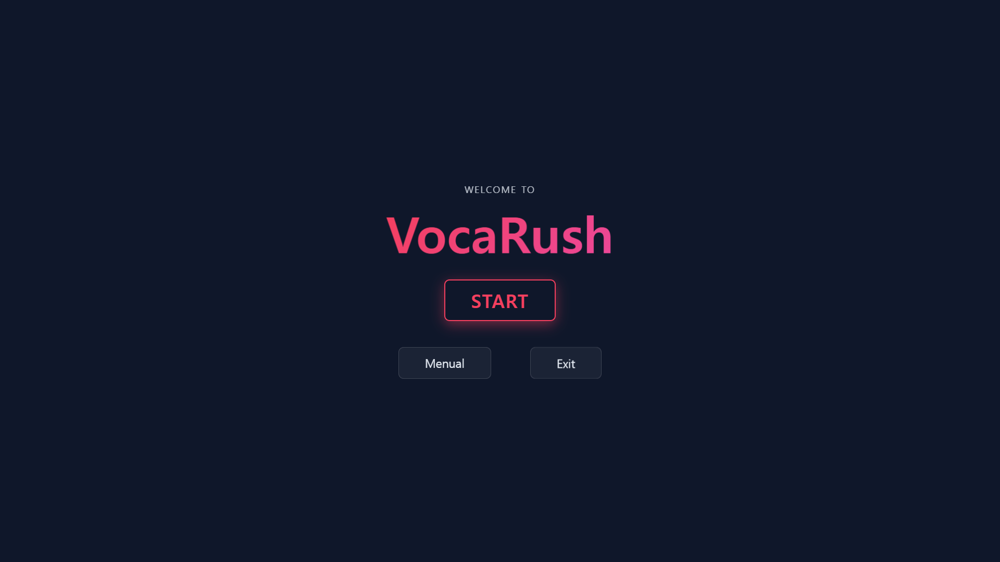
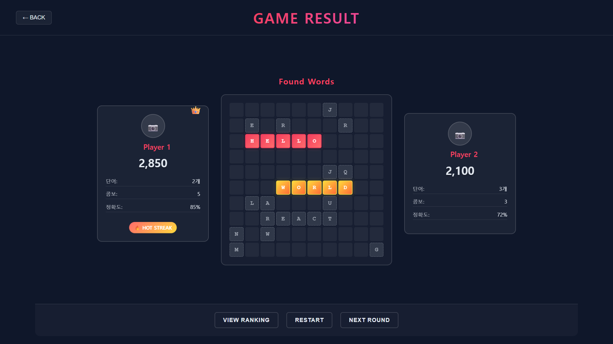

# 🧠 Electron VocaRush UI

> 콘솔 기반 2인 단어 배틀 게임 VocaRush의 UI 데모 프로젝트입니다.
> React와 Electron을 활용해 실제 동작 가능한 인터페이스를 구현 중입니다.

---

## 📌 프로젝트 개요

- **목표**: 기존 C++ 콘솔 게임 구조를 Electron + React 환경에서 시각적으로 재현
- **특징**:
  - 키보드 이벤트 기반 UI 흐름 구현
  - 보드 상태 실시간 시각화
  - 반응형 디자인 및 게임 흐름 분리

---

## 🖼️ 주요 화면

| StartView | GameView | ResultView |
|:--:|:--:|:--:|
|  |  |  |

---

## 🛠️ 사용 기술

| 구분 | 기술 |
|------|------|
| **Frontend** | React (Vite 기반), JSX |
| **UI 프레임워크** | Tailwind 기반 커스텀 스타일 |
| **앱 환경** | Electron |
| **배포 방식** | 로컬 실행 (데스크탑 앱 형태로 패키징 가능 예정) |

---

## 📂 프로젝트 구조

```bash
📁 src/
├── components/      # View 컴포넌트들 (StartView, GameView, ResultView 등)
├── styles/          # 공통 CSS
├── assets/          # 이미지, 폰트 등 리소스
├── App.jsx          # 전체 라우팅 관리
└── main.js          # Electron 진입점
```

## 🎥 데모 시연 영상
> ※ 아래 이미지를 클릭하시면 데모 플레이 영상을 확인하실 수 있습니다.

